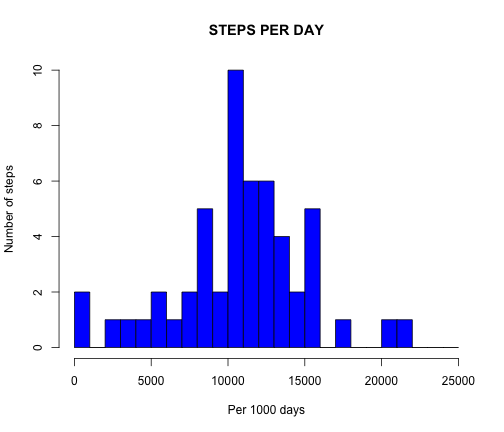
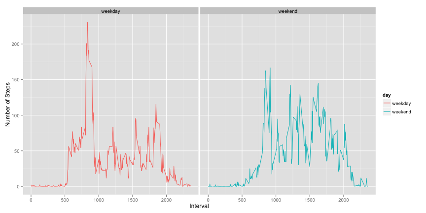

========================================================
# **Peer Assessment 1**, *Reproducible Research*
# *Data Science Specialization* at *Coursera*
## ======================================================
## I. Load and Preprocess Data 
### 1 and 2

```r
dat <- read.csv("activity.csv", quote="", header=T)
names(dat)<- c("Steps_in_5_min_interval", "Measurement_Date", "Interval_minute")
dim(dat)
```

```
## [1] 17568     3
```

```r
head(dat, n=3)
```

```
##   Steps_in_5_min_interval Measurement_Date Interval_minute
## 1                      NA     "2012-10-01"               0
## 2                      NA     "2012-10-01"               5
## 3                      NA     "2012-10-01"              10
```

```r
a <- aggregate(as.numeric(dat[,1])~dat[,2], data=dat,sum)
names(a) <- c("days", "steps")
dim(a)
```

```
## [1] 53  2
```

```r
head(a, n=3)
```

```
##           days steps
## 1 "2012-10-02"   126
## 2 "2012-10-03" 11352
## 3 "2012-10-04" 12116
```

## ======================================================
## II. What is mean total number of steps taken per day?  

### 1. Here is a histogram of number of steps per day with breaks at 1000 days for clarity. 


```r
hist(a[,2], main = "STEPS PER DAY", breaks = seq(0,25000,1000),
     xlab = "Per 1000 days", ylab ="Number of steps",
     col="blue")
```

 

```r
m <- format(mean(a$steps), digits=2, nsmall=2)
me <- format(median(a$steps), digits=2)
```
### 2. On an average, 10766.19 steps and a  median of 10765 steps were taken per day.

## ======================================================
## III. What is the average daily activity pattern? 
### 1.Time series plot

```r
b <- aggregate(as.numeric(dat[,1])~dat[,3], data=dat, mean)
head(b, n=3)
```

```
##   dat[, 3] as.numeric(dat[, 1])
## 1        0               1.7170
## 2        5               0.3396
## 3       10               0.1321
```

```r
dim(b)
```

```
## [1] 288   2
```

```r
plot(b[,2]~b[,1], type="l", main="AVERAGE DAILY ACTIVITY PATTERN",
     xlab = "5-min Time interval",
     ylab = "Average daily steps")
```

 

### 2. The 835-minute interval, on average across all the days in the dataset, contains the maximum number of steps.
## ======================================================
## IV. Imputing missing values
### 1. Calculate missing values

```r
miss <- dat[is.na(dat),]
missr <- nrow(miss)
```
### There are 2304 rows with missing values in the dataset.  
### 2 and 3. Impute missing values, make new dataset with imputed values

```r
# compute mean steps for 5 minute intervals
agg <- aggregate(as.numeric(dat[,1])~dat[,3], data=dat, mean)
# match interval minutes, replace NA with corresponding mean steps
r <- replace(miss[,1], miss$Interval_minute %in% agg[,1], agg[,2])
miss$Steps_in_5_min_interval <- r
# make new dataset with replaced values
compdat <- dat[complete.cases(dat),]
all <- rbind(miss, compdat)
all <- all[order(all$Measurement_Date),]
```
### 4. Make histogram of imputed data

```r
all_a <- aggregate(as.numeric(dat[,1])~dat[,2], data=dat,sum)
names(all_a) <- c("days", "steps")
hist(all_a[,2], main = "STEPS PER DAY", breaks = seq(0,25000,1000),
     xlab = "Per 1000 days", ylab ="Number of steps",
     col="blue")
```

 

### The 10766.19 mean steps  and  10765 median steps appear unchanged after imputing.
## ======================================================
## V. Are there differences in activity patterns between weekdays and weekends? 
### 1. Create new variable with two labels "weekend"" and "weekdays"

```r
#Convert Measurment_Date variable to date format, label as weekday vs weekend
dates0 <- all$Measurement_Date
dates <- as.POSIXct(strptime(as.character((dates0)), "\"%Y-%m-%d\""))
w <- weekdays(dates)
new <- ifelse(w %in% c("Saturday","Sunday"),"weekend", "weekday")
allb <- cbind(all,new)
```
### 2. Make time series plot for weekend vs weekdays

```r
allbwy <- allb[allb$new == "weekday",]
allbwend<- allb[allb$new == "weekend",]
aggweekday <- aggregate(as.numeric(allbwy[,1])~allbwy[,3], data=allbwy,mean)
aggweekend <- aggregate(as.numeric(allbwend[,1])~allbwend[,3], data=allbwend,mean)
aggweekday <- cbind(aggweekday, allbwy$new)
aggweekend <- cbind(aggweekend, allbwend$new)
names(aggweekday) <- c("Interval", "Number of steps", "day")
names(aggweekend) <- c("Interval", "Number of steps", "day")
tseries <- rbind(aggweekday, aggweekend)
library(ggplot2)
g <- ggplot(tseries,aes(tseries[,1], tseries[,2])) 
g + facet_grid(.~day) + geom_line(aes(colour=day)) + labs(x="Interval") + labs(y="Number of Steps")
```

 
